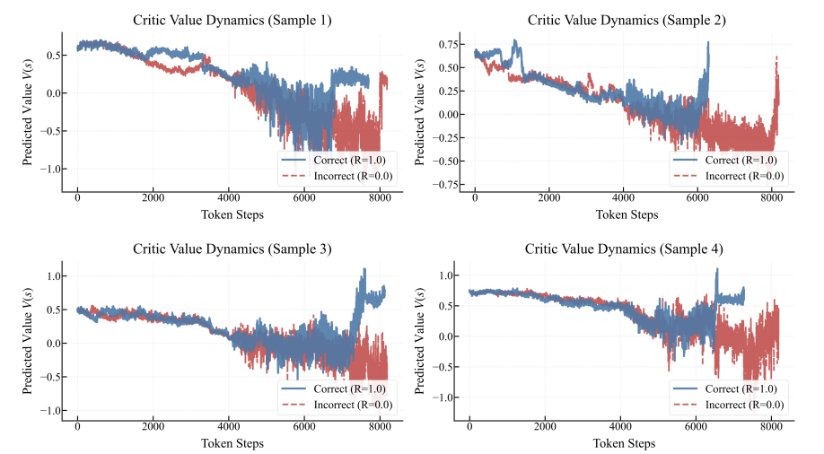
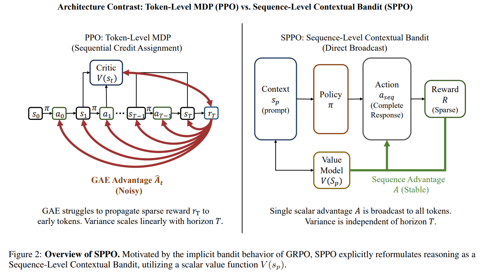

GRPO 与 SPPO 的动机、原理、公式及代码笔记。
<!--more-->

## 一、背景：RLVR 中的信用分配问题

在 Long-CoT RLVR（Reinforcement Learning with Verifiable Rewards，可验证奖励的强化学习）中，奖励通常只来自最终答案是否正确：

$$R \in \{0, 1\}$$

核心困难在于：**如何将最终答案的单一奖励信号合理地分配回整条推理链中的每一个 token。**

三种方法的思路：
- **PPO**：训练 token-level Critic，将最终奖励沿序列反向传播，但长序列下容易出现 Tail Effect；
- **GRPO**：不训练 Critic，改为对同一道题采样多条回答，用组内均值作为 baseline；
- **SPPO**：保留 Critic 但只让它看 Prompt（题目），将整条推理链建模为一个整体动作，用单次采样实现 sequence-level 优化。

## 二、GRPO（Group Relative Policy Optimization）

### 2.1 解决的问题

传统 PPO 中，Critic 需要估计每一个生成位置的 value：

$$V(s_1),\; V(s_2),\; \dots,\; V(s_T)$$

对于长推理任务，只有最终答案有奖励 $R \in \{0, 1\}$，Critic 很难判断前面数千个 token 中哪些真正推动了正确推理。

GRPO 选择**不训练 Critic**，而是：对同一道题生成多条回答，用这一组回答的平均成绩作为 baseline。

### 2.2 Advantage 计算

假设同一道题采样 $N$ 条回答 $a_1, a_2, \dots, a_N$，每条回答的奖励为 $R_i \in \{0, 1\}$。

GRPO 计算：

$$A_i = \frac{R_i - \mu_g}{\sigma_g + \epsilon}$$

其中 $\mu_g = \frac{1}{N}\sum_i R_i$ 表示同一道题这一组回答的平均成功率，$\sigma_g$ 为组内标准差。

**举例**：同一道题采样 8 条回答，仅 1 条正确。

- 奖励：$[1, 0, 0, 0, 0, 0, 0, 0]$
- 均值：$0.125$

正确回答明显比"同题平均水平"强很多，因此获得较强正向 advantage；错误回答则获得负向 advantage。这一 advantage 随后广播到该条回答的所有 token。

### 2.3 GRPO 代码

```python
def compute_grpo_outcome_advantage(
    token_level_rewards,  # [B, L]，最终答案奖励通常位于末尾
    response_mask,        # [B, L]，有效回答 token mask
    index,                # [B]，每条回答所属的 prompt ID
    epsilon=1e-6,
):
    with torch.no_grad():
        # 将 token reward 汇总成完整回答的结果分数
        scores = token_level_rewards.sum(dim=-1)  # [B]

        prompt_to_scores = defaultdict(list)

        # 将同一道题生成的多条回答放入同一组
        for i in range(scores.shape[0]):
            prompt_id = index[i]
            prompt_to_scores[prompt_id].append(scores[i])

        group_mean = {}
        group_std = {}

        # 计算每道题当前采样组的平均成功率与标准差
        for prompt_id, response_scores in prompt_to_scores.items():
            response_scores = torch.stack(response_scores)
            group_mean[prompt_id] = response_scores.mean()
            group_std[prompt_id] = response_scores.std()

        # 计算每条回答相对于同题其他回答的 advantage
        for i in range(scores.shape[0]):
            prompt_id = index[i]
            scores[i] = (
                scores[i] - group_mean[prompt_id]
            ) / (
                group_std[prompt_id] + epsilon
            )

        # 一个整体 advantage 广播给回答中的全部有效 token
        advantages = scores.unsqueeze(-1) * response_mask

    return advantages, advantages
```

## 三、Tail Effect

在长序列推理中，Critic 在推理过程早期很难区分正确轨迹和错误轨迹，直到接近答案尾部时，value 才明显分开。这意味着 token-level Critic 的大部分"判断力"集中在序列末尾，前面的 token 几乎得不到有效的信用分配信号。



## 四、SPPO（Sequence-Level Policy Optimization）

### 4.1 核心动机

- PPO 的 token-level Critic 在长序列下容易出现 Tail Effect，训练不稳定；
- GRPO 通过同题多采样实现 sequence-level 更新，较稳定，但每道题需要 $N$ 次采样，rollout 成本高；
- SPPO 认为 GRPO 有效的关键在于 **sequence-level optimization**，而非是否去掉 Critic；
- 因此 SPPO 保留 Critic，但让它只读取 Prompt，以**单次采样**构造 sequence-level advantage，兼顾稳定性与效率。

### 4.2 从 MDP 到 Sequence-Level Contextual Bandit

**传统 PPO 视角**（每个 token 都是一小步动作）：

$$s_0 \rightarrow a_0 \rightarrow s_1 \rightarrow a_1 \rightarrow \dots \rightarrow s_T$$

**SPPO 视角**（整条推理链折叠为一个动作）：

$$\text{Prompt } s_p \rightarrow \text{Complete Response } a_{\text{seq}} \rightarrow R$$

其中：
- Context：题目 $s_p$
- Action：完整回答 $a_{\text{seq}}$
- Reward：最终答案是否正确 $R$

SPPO 在建模上将 horizon 折叠为 $H = 1$。

> **注意**：模型在实际生成时仍然是逐 token 生成的；SPPO 改变的不是生成方式，而是**奖励和 advantage 的定义方式**。这一区分非常重要。

### 4.3 Prompt-only Scalar Critic

**传统 PPO 的 Critic** 输入包含已生成的部分推理内容，因此容易出现 Tail Effect：

$$V(s_t) = V(s_p, y_1, \dots, y_t)$$

**SPPO 的 Critic** 只读取题目：

$$V_\phi(s_p)$$

它预测的是：**当前策略模型面对这道题时，最终答对的概率是多少？**

例如：
- 简单题：$V(s_p) = 0.85$
- 中等题：$V(s_p) = 0.50$
- 难题：$V(s_p) = 0.10$

这个 Critic 不负责判断哪一步推理正确，只判断题目对当前模型来说有多容易解决——即论文中的 **scalar solvability estimation**。

在 SPPO 的实验中，Actor 和 Critic 都基于 DeepSeek-R1-Distill-Qwen 系列大语言模型，本质上都是 Transformer backbone；区别在于它们承担的任务和输出头不同。

### 4.4 SPPO 的 Advantage

SPPO 定义：

$$A(s_p, a) = R - V_\phi(s_p)$$

其中 $R \in \{0, 1\}$ 为最终答案的正确性。

| 题目类型 | Critic 预测 | 实际结果 | Advantage |
|---|---|---|---|
| 难题罕见做对 | 0.10 | 1 | +0.90 |
| 难题正常做错 | 0.10 | 0 | −0.10 |
| 简单题正常做对 | 0.90 | 1 | +0.10 |
| 简单题意外做错 | 0.90 | 0 | −0.90 |

这个机制和 GRPO 的直觉一致：
- 困难题偶然做对 → 大力奖励
- 简单题偶然做错 → 大力惩罚
- 符合预期的结果 → 小幅更新

但它不需要对同一道题采样 $N$ 次，因为题目难度由学习出来的 Critic 提供。

### 4.5 Critic 的训练

$V_\phi(s_p)$ 预测的是成功概率（标量），论文使用 Binary Cross-Entropy：

$$\mathcal{L}_V(\phi) = -\mathbb{E}\Bigl[ R\log V_\phi(s_p) + (1-R)\log\bigl(1 - V_\phi(s_p)\bigr) \Bigr]$$

例如：Critic 预测成功概率为 0.9，但实际答错——BCE 会强烈惩罚这一错误预测。

随着训练推进，Critic 学习到当前 Actor 对不同题目的成功率，相当于一个不断更新的"题目难度预测器"。

### 4.6 策略更新

SPPO 仍然保留 PPO 的 clipping 结构：

$$J_{\text{SPPO}}(\theta) = \mathbb{E}_{s_p, a, t}\Bigl[ \min\bigl( r_t(\theta) A(s_p, a),\; \operatorname{clip}(r_t(\theta), 1-\epsilon, 1+\epsilon) A(s_p, a) \bigr) \Bigr]$$

关键变化只有一个：

- **传统 PPO**：$A_1, A_2, \dots, A_T$，每个 token 的 advantage 不同
- **SPPO**：$A_1 = A_2 = \dots = A_T = A(s_p, a)$，整条回答共享同一个 advantage

如果某条回答最终正确且比 Critic 预期更好（$A > 0$），整条回答中的所有 token 都被强化；如果最终错误且比预期更差（$A < 0$），整条回答中的所有 token 都被抑制。这对应论文中的 **Direct Broadcast**：一个 sequence-level advantage 直接广播到整条回答。

### 4.7 SPPO 代码

```python
@register_adv_est("sequence_level_adv")
def compute_sequence_level_advantage(
    token_level_rewards: torch.Tensor,
    values: torch.Tensor,
    response_mask: torch.Tensor,
    config: Optional[AlgoConfig] = None,
    epsilon: float = 1e-8,
    **kwargs,
) -> Tuple[torch.Tensor, torch.Tensor]:
    with torch.no_grad():
        # 汇总整条回答的最终奖励
        R = token_level_rewards.sum(dim=-1)

        # Critic 输出 logit，经 sigmoid 转为成功概率
        V_s_prompt_logit = values
        V_s_prompt_prob = torch.sigmoid(V_s_prompt_logit)

        # 序列级 advantage：R - V(s_p)
        adv = R - V_s_prompt_prob

        # 广播到整条回答的所有 token
        advantages = adv.unsqueeze(-1) * response_mask

        # SPPO 中 Critic 的训练目标直接使用 R
        returns_target_R = R

        return advantages, returns_target_R
```

## 五、三种方法对比

| 方法 | Baseline 来源 | Advantage 粒度 | 每题采样数 | 优点 | 缺点 |
|---|---|---|---|---|---|
| PPO | Token-level Critic $V(s_t)$ | 每个 token 独立 | 1 | 样本效率高 | 长 CoT 下信用分配不稳定 |
| GRPO | 同题多回答的组内均值/方差 | 整条回答共享 | $N>1$，论文中为 8 | 序列级更新稳定 | Rollout 成本高 |
| SPPO | Prompt-only Critic $V(s_p)$ | 整条回答共享 | 1 | 稳定且高效 | 依赖可靠的终点奖励与 Critic |

## 六、SPPO 核心贡献总结

1. 指出 GRPO 的有效性主要来自 **sequence-level optimization**，而不只是去掉 Critic
2. 将长程推理建模为 **Sequence-Level Contextual Bandit**：Prompt 是 Context，完整回答是 Action
3. 设计 **Prompt-only Scalar Critic**，以 $A = R - V(s_p)$ 构造单样本序列级优势信号
4. 验证 Small Critic 可用轻量价值模型对齐更大 Policy，在提升性能的同时降低训练显存与时间开销

**一句话总结**：SPPO 用 Prompt-only Scalar Critic 替代 GRPO 的多采样 baseline，将长程推理从 token-level 信用分配转为 sequence-level 优化，从而以单次采样实现更稳定、更高效的 RLVR 训练。



## 附录：标准 PPO GAE 计算（参考）

以下为传统 PPO 中 GAE 的计算方式，与上文 GRPO/SPPO 的 advantage 计算形成对比：

```python
def compute_gae_advantage_return(
    token_level_rewards,  # [B, L]，每个 token 位置上的 reward
    values,               # [B, L]，Critic 对每个 token 状态的 value 预测
    response_mask,        # [B, L]，真实 token 为 1，padding 为 0
    gamma,
    lam,
):
    with torch.no_grad():
        nextvalues = 0
        lastgaelam = 0
        advantages_reversed = []
        response_length = token_level_rewards.shape[-1]

        # 从最后一个生成 token 向前计算
        for t in reversed(range(response_length)):

            # TD error:
            # δ_t = r_t + γ V(s_{t+1}) - V(s_t)
            delta = (
                token_level_rewards[:, t]
                + gamma * nextvalues
                - values[:, t]
            )

            # GAE 递推：
            # A_t = δ_t + γλ A_{t+1}
            current_advantage = (
                delta
                + gamma * lam * lastgaelam
            )

            # padding token 不应影响递推过程
            nextvalues = (
                values[:, t] * response_mask[:, t]
                + nextvalues * (1 - response_mask[:, t])
            )

            lastgaelam = (
                current_advantage * response_mask[:, t]
                + lastgaelam * (1 - response_mask[:, t])
            )

            advantages_reversed.append(lastgaelam)

        # 恢复为 token1 → tokenT 的正常顺序
        advantages = torch.stack(advantages_reversed[::-1], dim=1)

        # PPO 训练 Critic 时使用的目标 return
        returns = advantages + values

        # 对有效 token 的 advantage 做归一化
        advantages = verl_F.masked_whiten(advantages, response_mask)

    return advantages, returns
```

核心区别一目了然：
- **PPO / GAE**：逐 token 反向递推计算 advantage，每个 token 有不同的 $A_t$
- **GRPO**：整条回答共享同一个组内标准化后的 advantage
- **SPPO**：整条回答共享同一个 $R - V(s_p)$，由 Prompt-only Critic 提供 baseline
